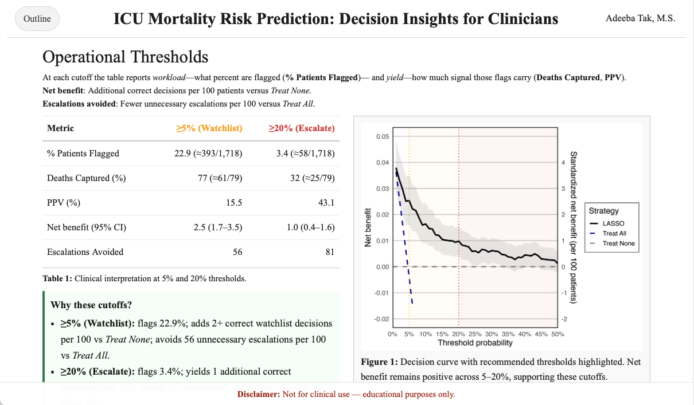

# ICU Mortality Risk Prediction Model

::: {align="center"}
## [](https://adeebatak11.github.io/icu_mortality/)
:::

A prognostic predictive modeling project developing an ICU mortality risk prediction model using the eICU Collaborative Research Database. This project compares traditional logistic regression with LASSO penalized regression to predict in-hospital mortality for ICU patients. The final model prioritizes interpretability over algorithmic complexity.

## Dataset

eICU Collaborative Research Database v2.0.1 - Multi-center ICU database with de-identified patient records. See `data/README.md` for detailed references.

## Project Structure

```         
icu_mortality/
├── scripts/                    # Analysis workflow
│   ├── 01_data_load_and_connect.R    
│   ├── 02_clean_data.R               
│   ├── 03_feature_selection.R        
│   ├── 04_run_glm_model.R            
│   ├── 05_run_lasso_model.R         
│   ├── 06_compare_models.R           
│   ├── 07_validate_model.R           
│   ├── Appendix.R                    
│   └── sql/                          
├── data/                    # Data                    
│   └── README.md        
├── docs/                                          
│   ├── annotated_bibliography.md     
│   ├── images/                       
└── renv/                       
```

### Running the Analysis

1.  **Clone and setup:**

    ``` r
    # Restore package environment
    renv::restore()
    ```

2.  **Execute analysis pipeline:**

    ``` r
    # Run scripts in order:
    source("scripts/01_data_load_and_connect.R")
    source("scripts/02_clean_data.R")
    source("scripts/03_feature_selection.R")
    source("scripts/04_run_glm_model.R")
    source("scripts/05_run_lasso_model.R")
    source("scripts/06_compare_models.R")
    source("scripts/07_validate_model.R")
    ```

## References

This project follows established clinical prediction modeling guidelines and draws from key literature in ICU mortality prediction. See `docs/annotated_bibliography.md` for detailed references.

## License

This project uses the eICU Collaborative Research Database under the PhysioNet Credentialed Health Data License 1.5.0. The analysis code is available for research and educational purposes.
